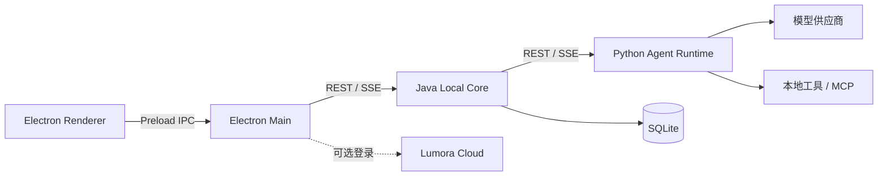

<p align="center">
  
</p>

<h1 align="center">LUMORA</h1>

<p align="center">面向 Windows 的本地通用 AI Agent 桌面应用</p>

<p align="center">
  
  
  
  
</p>

LUMORA 将桌面交互、本地业务状态和 Agent 推理编排拆分为三个独立运行时。它可以连接用户自己的
模型供应商，也可以在登录后使用 Lumora Cloud 套餐模型；任务、消息、审批、用量和工作区状态均由
本机保存和控制。

> **项目状态：持续开发中。** 核心对话、工具循环、审批、上下文压缩、多 Agent、Git Changes、
> Worktree、Memory、MCP 与崩溃恢复链路已经打通。OCR、复杂文档处理、插件运行时和更严格的
> Windows Worker 隔离仍在迭代。

## 核心能力

| 能力 | 当前实现 |
| --- | --- |
| Agent 工作流 | 流式对话、动态计划、工具循环、暂停恢复、问题队列与运行中引导 |
| 多 Agent | Supervisor、可续接子 Session、耐久 Inbox、共享预算和可选 DAG 调度 |
| 工作区 | 文件读写、Shell、资源协调、陈旧写入保护和跨进程写入租约 |
| Git 协作 | Run 级 Diff、整轮撤回、分支审阅、显式 Worktree 和三方应用 |
| 扩展能力 | MCP Tools、Resources、Prompts、项目/个人 Skills 和托管 Web Search |
| 本地数据 | SQLite 会话持久化、Memory、Artifact、Token Usage 与上下文快照 |
| 模型接入 | Chat Completions、OpenAI Responses、Anthropic Messages 和 Lumora Cloud |
| 安全边界 | 确定性风险分级、自动 Reviewer、人工审批、Preload 白名单与 DPAPI 加密 |

## 运行架构



三个运行时不互相导入源码，只通过明确的 IPC、REST 与 SSE 契约通信。

| 目录 | 技术 | 职责 |
| --- | --- | --- |
| [`desktop/`](desktop/README.md) | Electron、React、TypeScript | 桌面窗口、交互、系统能力和安全存储 |
| [`core/`](core/README.md) | Java 21、Spring Boot、SQLite | 本地事实来源、任务调度、审计和运行事件 |
| [`agent/`](agent/README.md) | Python 3.12、FastAPI | 模型适配、推理编排、工具执行和权限决策 |
| [`contracts/`](contracts/) | REST / SSE 契约 | Java 与 Python 的跨进程协议 |
| [`integration/`](integration/README.md) | PowerShell | 跨工程结构检查和统一验证 |

## 模型与云端

LUMORA 支持两种可随时切换的模型来源：

- **本地 BYOK**：未登录也可使用，在“设置 → 模型与 API”中管理供应商、模型和加密 API Key。
- **Lumora Cloud**：登录后读取当前套餐、额度和允许模型，通过本机受控代理调用云端模型网关。

购买、续费和充值统一在系统浏览器打开的 Cloud 用户控制台完成；Desktop 只读取权益和用量。
更多边界见 [Lumora Cloud 设计](https://github.com/fkwhao/LUMORA_CLOUD/blob/main/docs/cloud-platform-design.md)。

## 本地开发

### 环境要求

- Windows 10/11
- Node.js 24 与 pnpm 11
- JDK 21 与 Maven
- Python 3.12

复制三份本机配置模板，并为 Core 与 Agent、Desktop 与 Core 分别配置相同的开发令牌：

```text
agent/config/dev-local.example.yml
  → agent/config/dev-local.yml
core/src/main/resources/application-dev-local.example.yml
  → core/src/main/resources/application-dev-local.yml
desktop/config/dev-local.example.yml
  → desktop/config/dev-local.yml
```

按以下顺序启动：

```powershell
# 1. Python Agent Runtime
cd agent
python -m pip install -r requirements-dev.txt
$env:PYTHONPATH = (Resolve-Path '.').Path
python -m app.main

# 2. Java Local Core（另一个终端，启用 dev-local Profile）
cd core
.\mvnw.cmd spring-boot:run "-Dspring-boot.run.profiles=dev-local"

# 3. Electron Desktop（另一个终端）
cd desktop
pnpm install
pnpm start
```

Java Core 推荐通过 IntelliJ IDEA 使用 `dev-local` Profile 启动。完整配置、IDE 设置和模型连接方式见
[开发指南](docs/development.md)。

## 验证

不编译 Java 的日常跨工程检查：

```powershell
powershell -ExecutionPolicy Bypass -File integration/verify.ps1
```

配置 JDK 21 和 Maven 后运行完整检查：

```powershell
powershell -ExecutionPolicy Bypass -File integration/verify.ps1 -IncludeJava
```

## 文档

| 文档 | 内容 |
| --- | --- |
| [公开架构说明](docs/architecture.md) | 运行架构、数据归属和核心边界 |
| [开发指南](docs/development.md) | 本机配置、启动方式和统一验证 |
| [并发与资源协调](docs/cross-task-concurrency-design.md) | Run 调度、文件锁和陈旧覆盖保护 |
| [Supervisor 多 Agent](docs/supervisor-multi-agent-design.md) | Session、事件、委派和 DAG |
| [Git Changes 与 Worktree](docs/git-run-changes-design.md) | Diff、撤回、隔离与结果应用 |
| [附件设计](docs/attachment-design.md) | 图片、文件和 PDF 的生命周期与安全边界 |
| [问题队列与 Steer](docs/conversation-input-queue-design.md) | 排队、运行中引导和暂停恢复 |

## 安全说明

真实 API Key、启动令牌、`.env`、本机 YAML、数据库和日志不得提交。Renderer 无法直接访问
Node.js、后端地址、启动令牌或模型密钥；本地 API Key 由 Windows DPAPI 加密后保存。
